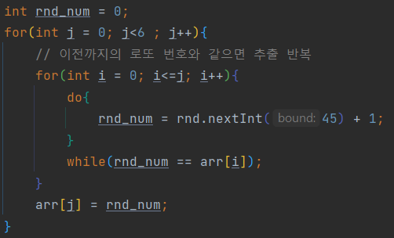
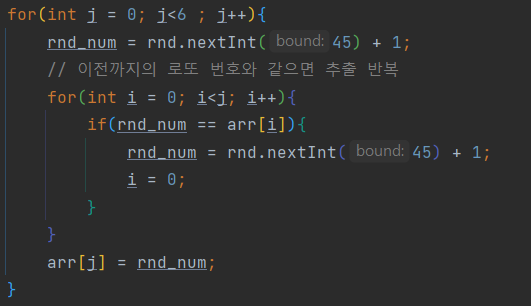

### Quiz1

---

구구단을 형식에 맞게 출력하는 문제
- 문자열을 형식에 맞게 출력하기 위해선 `printf` 뿐 아니라 `String.format()`을 사용할 수도 있다는 것을 알게됨.
- printf와 String.format은 괄호 안에 들어가는 형식이 동일.
- 하지만 printf는 바로 출력을 하고 String.format은 String을 리턴한다는 점이 다르다.

### Quiz2

---

결제액을 입력받고 그에 따른 캐쉬백을 출력하는 문제

- Scanner로 입력 받는 것 잊고 있었는데 다시 상기시켜줌 
  - `import java.util.Scanner;` `Scanner scanner = new Scanner(System.in);` `String s = scanner.nextLine();`
- 정수를 100원 단위로 자르는 방법 : random int를 추출하는 방법과 유사
  - 내림하려는 자리수만큼 10의 지수승으로 나눈 다음, floor로 소숫점 아래를 자르고 다시 10의 지수승을 곱하는 방법
  - `double cashBack = Math.floor(cashBak*0.01)*100;` // floor은 double을 리턴

### Quiz3

---

입력에 따라 놀이공원 입장 요금을 계산하는 문제

- scanner.nextLine() : enter을 기준으로 입력을 받음
- scanner.next() : white space(띄어쓰기, 엔터, 탭)을 기준으로 입력을 받음

### Quiz4

---

랜덤으로 주민등록번호를 생성하는 문제

- 파이썬의 난수 생성에 길들여졌기 때문에 조금 해맴..
- 자바에서는 Random클래스의 오브젝트를 만들어서 사용함 `Random random = new Random();`
- Random 클래스 사용을 위해서는 `import java.util.Random;` 선언 필요
- `random.nextInt()` : int 범위 (-2^31 ~ +2^31-1)에 있는 임의의 정수 추출
- `random.nextInt(i)` : 0부터 i 미만의 범위에 있는 임의의 정수 추출
  - `random.nextInt(a) + b` : b부터 a+b-1의 범위에 있는 임의의 정수 추출 

### Quiz5

---

달력 출력하는 문제

- LocalDate 클래스 이용
  - LocalDate는 로컬 컴퓨터의 날짜를 담는 포맷, 비슷하게 LocalTime(시간), LocalDateTime(날짜와 시간) 클래스가 있음
  - `import java.time.LocalDate;` 필요
  - `LocalDate localdate = LocalDate.now();` : 현재 시간을 yyyy-mm-dd 형태로 저장
  - 날짜가 속한 달의 일수 구하기 : `int days = localDate.lengthOfMonth();`
  - 첫번째 날짜의 요일 구하기 (Mon-1, Sun-7) : `int dayOfWeek = localDate.getDayOfWeek().getValue();`
- LocalDate 말고 Calendar와 Date 클래스도 사용가능하긴 하지만, 이젠 사장되는 추세

### Quiz6

---

대선 결과 랜덤 시뮬레이션 문제

- 무작위 투표를 위해 Random 클래스의 `nextInt()` 필요
- String.format에서 double 소숫점 처리할 때 헷갈린 것 
  - %5.2f는 전체 소수의 길이가 5(소숫점 포함), 소숫점 밑의 길이가 2이므로 xx.xx를 의미함

### Quiz7

---

로또 당첨 프로그램

- 배열을 정렬하는 방법 : `Arrays.sort(arr);`
- 이전까지의 로또 번호와 같으면 다시 추출하는 코드에서 실수 발생
- 
- 여기서 j는 로또 번호가 추출되는 순서를 의미하고, i는 이미 추출된 것과 `rnd_num`을 비교하기 위한 scanner의 역할
- 따라서 i마다 `rnd_num`을 뽑는 것은 의미가 없음 
  - e.g. j = 5, rnd_num = 3에 대해서 arr[0~4]까지 중 `rnd_num`과 같은게 있으면 다시 추출해야하는데, 
  - 위 코드는 arr[0]와 불일치하는 rnd_num을 추출하고, arr[1]과 불일치하는 `rnd_num`을 추출하고,.. 
  - arr[5]와 불일치하는 `rnd_num`을 추출해서 arr[5]에 넣기 때문에 이때의 `rnd_num`은 arr[0~4]와 동일할 수도 있음
- 수정된 코드 : `rnd_num`은 i의 for문 밖에서 결정되고, j와 같을 때만 재추출!
- 

### Quiz8

