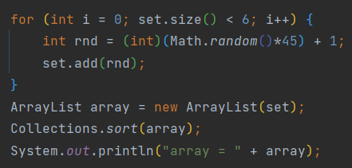

## 컬렉션 프레임워크 복습

---

- 컬렉션 프레임워크를 선언할 때 `<T>`를 굳이 적지 않아도 된다.
- `.contains(Object)` : 컬렉션 프레임워크에 해당 Object가 있는지 boolean으로 리턴하는 함수
- `.isEmpty()` : 컬렉션의 사이즈가 0인지 boolean으로 리턴하는 함수
- `.indexOf(Object)` : 해당 Object가 있는 인덱스 중 가장 앞에 있는 인덱스를 리턴한다.
- Array to ArrayList : `ArrayList arrayList = new ArrayList(Arrays.asList(array));`
- ArrayList to Array : `T[] arr1 = arraylist.toArray(new T[arraylist.size()]);` 이때 T는 Intger처럼 class여야 함
- 로또 문제를 Set을 이용하면 훨씬 간단히 구현할 수 있다. (중복되는 값은 add가 안되므로 & sort하기 위해선 다시 ArrayList로)
  

### Stack
- 주요 함수 : push, pop, peek(top 리턴)

### Mission1

---

스택 4개를 이용해서 정렬이 가능한지 확인하는 문제
- 스택을 이용한 정렬 문제인건 알겠는데, 4개의 스택 중 **어떤 스택에 삽입할지**, 4개의 스택 중 **어떤 스택에서 pop할지**의 기준을 문제에서 명시하지 않아서 어려웠던 문제
- 문제에서 원하는 것은 모든 경우의 수 중에서 성공할 수 있는 것은 무엇이든 성공하면 "YES", 모든 경우에서 실패하면 "NO"를 출력하는 것이었다.
- idea
  - 이 문제는 2 phase로 해결된다. 1) 스택에 삽입 2) 스택에서 추출
  - 추출은 방법이 하나밖에 없다 → 네 스택의 top을 비교해서 가장 큰 것을 pop하는 것을 반복
  - 따라서 정렬은 성공 여부에 영향을 주지 않는다. 설계해야 할 것은 삽입하는 부분이다.
  - `모든 스택이 오름차순으로 삽입되어야` 위의 추출로 정렬이 성공한다.
- 모든 스택이 오름차순으로 삽입되기 위해서는 stack의 top이 입력된 것보다 크면 안된다.
- 동시에 stack의 top은 현존하는 top들 중에서 가장 큰 top이여야 한다. 
  - e.g. {2, 7, 8, 9}가 있고 10을 삽입하려 하면 2에 삽입하면 이제 7보다 큰 것만 받을 수 있지만, 9에 삽입하면 2보다 큰 것은 다 받을 수 있이므로
- 따라서 삽입하는 과정은 다음과 같다.
  1. top 중에서 입력보다 작은 것을 구한다.
  2. 그 중에서 가장 큰 top이 있는 stack에 삽입한다.

### Bonus1

---

연속된 숫자를 제거하는 문제

- stack의 크기가 0이면 삽입한다.
- stack의 peek은 직전에 삽입된 것이므로 peek과 동일하면 삽입하지 않는다.

### Mission2

---

데크(양방향 큐)를 이용해 shift를 하고, 최소한의 shift 연산 수를 구하는 문제
- 큐 선언 : `Queue<E> queue = new LinkedList<>();`
- 데크 선언 : `Deque<E> deque = new LinkedList<>() || new ArrayDeque<>();`
  - 여러 클래스들이 Deque 인터페이스를 구현하므로 다양한 방법으로 생성할 수 있다. (ArrayDeque, LinkedBlockingDeque, ConcurrentLinkedDeque, LinkedList)
  - 이중 LinkedList와 ArrayDeque를 많이 사용하는데, indexOf를 써야하는 상황에서는 LinkedList, 다른 경우에서는 ArrayDeque가 더 성능이 좋으므로 ArrayDeque를 사용하면 된다.
  - 출처 : https://tech-monster.tistory.com/159

### Bonus2

---

업데이트가 다 되면 업데이트를 종료하는 문제 (뒤에 있는 것이 먼저 업데이트 완료되더라도 앞이 종료되지 않으면 종료하지 않음)
- 딱히 새로 알게된 개념 없음

### Mission3

---

배열의 최대, 최소를 출력하는 문제
- min, max의 integer 변수를 선언하고 min보다 작거나 max보다 크면 업데이트 시켜줌

### Bonus3

---

입력된 수에 의해 나누어떨어지는 것을 정렬 후 출력하는 문제 
- Array to stream : `Arrays.stream(array)`
- ArrayList sort : `Collections.sort(arraylist)`

### HashQuiz

---

- String to char array : `char[] charArr = string.toCharArray();` : 문자열에서 한 글자씩 enhances for문을 적용하고 싶을 때 사용할 수 있음
- HashMap 주요 함수
  - `hm.getOrDefault(k,default_value)` : key가 저장되어있으면 그 값을 리턴, 없으면 디폴트 값을 리턴
  - e.g.`hm.put(c, hm.getOrDefault(c,0)+1);` : c에 해당하는 값이 있으면 그 값 + 1을 저장, 없으면 c에 1을 저장
  - 위 코드는 빈도를 체크할 때 유용함
- String을 더할때는 `+=`가 아니라 `StringBuilder`객체를 사용하는게 좋다. String은 길이가 변할 수 없는 객체를 만들므로 +=를 사용하면, 길이가 달라진 String 객체를 새롭게 생성하여 그 값을 리턴한다. 하지만 StringBuilder을 사용하면 가변 길이의 String 객체를 생성하므로 String을 합칠 때 사용하면 좋다.
  - `StringBuilder sb = new StringBuilder();` `sb.append("자바").append("최고");`
  - StringBuilder을 String으로 바꾸기 위해선 `toString()` 메소드를 사용하면 된다.

### Mission4

---

- 나머지에 대해 얼마나 영리하게 이해하느냐 묻는 문제
- 주어진 수식에서 P_0가 될 수 있는 범위는 0~M-1이다. 
- 따라서 P_0을 제외한 수가 고정되어있다고 할 경우 주어진 해시값을 만족하는 비밀번호는 1개이다. 
- P_0을 제외한 수의 조합은 M**(N-1)개이다. 
- M**(N-1)개의 조합에서 조합 당 하나의 숫자만 주어진 해시값을 만족한다. 
- 따라서 어떤 해시값이 주어지더라도, M**(N-1)을 리턴하기만 하면 된다.
- ❗오버플로우 방지 : for문 안에서 하나씩 곱하여 Math.pow를 구현하고, for문 안에서 나머지 연산을 수행하여 방지할 수 있음

### Bonus4

---

- 자바에서는 파이썬처럼 [-1]로 배열의 마지막 원소에 접근할 수 없다.
  - clothes[clothes.length-1]로 접근해야 함